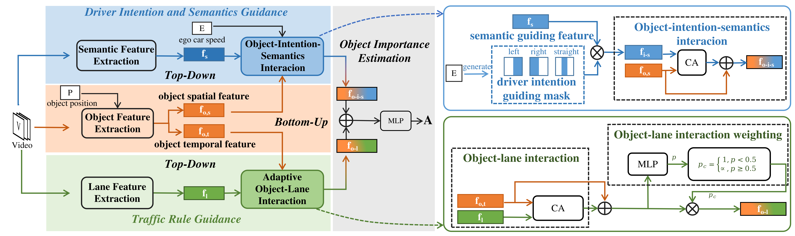
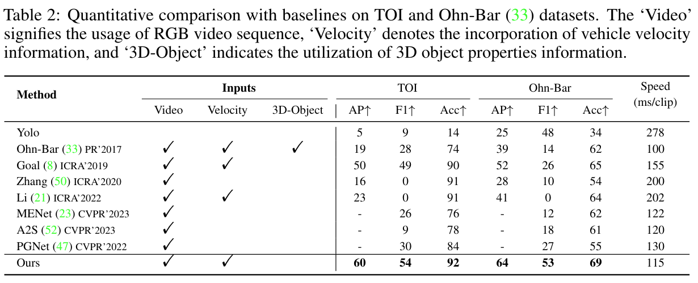

<h2 align="center"> On Road Object Importance Estimation A New Dataset and A Model with Multi-Fold Top-Down Guidance</a></h2>
<h4 align="center" color="A0A0A0"> Zhixiong Nan, Yilong Chen, Tianfei Zhou, Tao Xiang</h4>
<h5 align="center"> If you like our project, please give us a star ⭐ on GitHub for the latest update.</h5>

<div align="center">

[](https://github.com/CQU-ADHRI-Lab/TOI)
[](https://github.com/CQU-ADHRI-Lab/TOI/blob/main/LICENSE)

</div>


# Multi-Fold Top-Down Guidance Estimation Model

This is the official implementation of the paper "On Road Object Importance Estimation A New Dataset and A Model with Multi-Fold Top-Down Guidance".

<div align="center">
  
</div><br/>


This is the quantitative comparison results on TOI and [Ohn-Bar](https://github.com/eshed1/Object_Importance) datasets.

<div align="center">
  
</div><br/>

## Update
[2024/9] TOI has been accepted at NeurIPS 2024 as a poster!

## Traffic Object Importance (TOI) Dataset
### Folder Description: <br>
The object importance annotation results of TOI are located in the "annotation" folder. There are a total of 28 txt files, which correspond to the annotations of 28 videos. The filenames correspond to the raw data in the KITTI official dataset.

### To Do: <br>
To use these annotations, you need to download the Raw Data from the [KITTI](https://www.cvlibs.net/datasets/kitti/raw_data.php). The files that need to be downloaded are [synced+rectified data].


## <a name="CitingTOI"></a>Citing TOI

If you find our work helpful for your research, please consider citing the following BibTeX entry.

```BibTeX
@misc{nan2024toi,
      title={On-Road Object Importance Estimation: A New Dataset and A Model with Multi-Fold Top-Down Guidance}, 
      author={Zhixiong Nan and Yilong Chen and Tianfei Zhou and Tao Xiang},
      year={2024},
      eprint={2411.17152},
      archivePrefix={arXiv},
      url={https://arxiv.org/abs/2411.17152}, 
}
```
